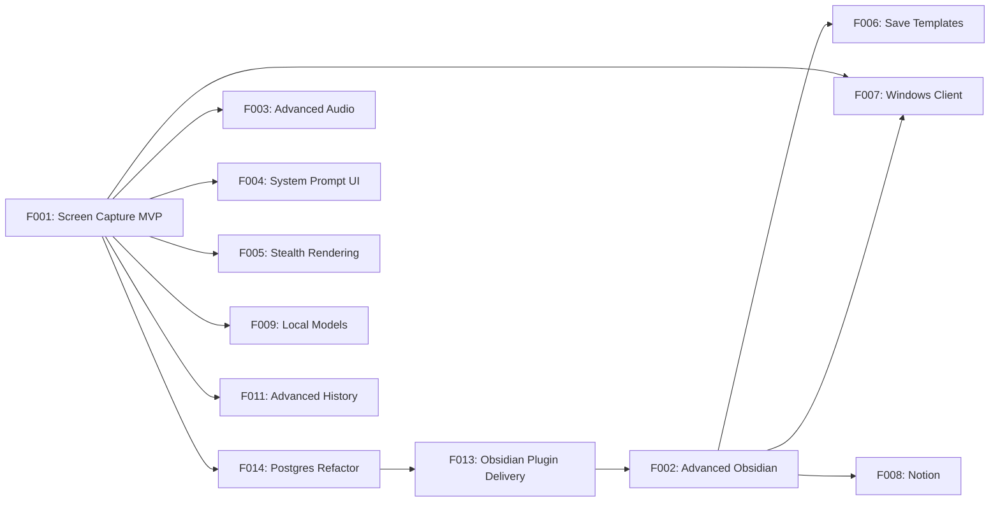

# GotIt! Feature Board

> Feature-level source of truth for roadmap, dependencies, and implementation sequencing.

> Feature backlog and sprint planning. Each feature follows the pipeline: brainstorming → spec → plan → implementation → validation.

## In Progress

- [ ] **F001** Screen Capture + Chat MVP — Core functionality: screenshot analysis, keybind-triggered one-shot vision, invoke-to-open chat panel, chat-driven screen refresh, floating chat panel, backend AI analysis, persistent active session, append-to-current-chat behavior, reset context, basic history tab, basic text chat, basic Obsidian save, push-to-talk voice messages, and basic "Listen to this" system-audio capture
  - Depends on: _none_
  - Parent spec: `docs/specs/f001-screen-capture-mvp.md` ✓
  - Phase 1a Plan A (backend): `docs/plans/f001-phase-1a-backend.md` ✓ **complete, validated 9.4/10 on 2026-04-29**
  - Phase 1a Plan B (macOS client): `docs/specs/f001-phase-1a-macos-client.md` ✓ — implementation plan pending (`docs/plans/f001-phase-1a-macos-client.md` to be written next)
  - Phase 1b (mic), 1c (Listen), 1d (history): not started

- [ ] **F014** Postgres Storage Refactor (docker-compose) — Replace the SQLite `Store` infrastructure wrapper in `packages/api` with Postgres provisioned via a single `.env`-driven Docker Compose file for local development and single-host production deployment. Small, scoped refactor: swap the wrapper implementation, port the migration files (`packages/api/migrations/`) to Postgres dialect, add `docker-compose.yml`, update `.env.template` (e.g., `GOTIT_DATABASE_URL`). No product behavior change. **Top priority before F013** — done before Obsidian Plugin Delivery to avoid migrating a Postgres-shaped dataset twice.
  - Depends on: F001 Phase 1a Plan B (started)
  - Spec: `docs/specs/f014-postgres-storage-refactor.md` ✓
  - Introduces: `docker-compose.yml`, Postgres `Store` adapter (still behind same protocol), Postgres-dialect migrations, env var changes.

## Planned (Next Sprint)

_No feature queued. F014 is now in progress._

## Backlog (Prioritized)

- [ ] **F013** Obsidian Plugin Delivery — Real Obsidian plugin (TypeScript, Obsidian plugin API) plus SSE delivery from the backend. Replaces the Phase 1a direct file-write path with a proper Vault API write. Unlocks cross-client reuse (F007) and proper indexing/sync. Phase 1a chooses file-write delivery as a deliberate stop-gap; F013 is the durable answer and is sequenced **after F014, ahead of F002**.
  - Depends on: F001, F014
  - Spec: `docs/specs/f013-obsidian-plugin-delivery.md` _(pending)_
  - Introduces: new package `apps/obsidian-plugin/` (TS), backend endpoints `GET /saves/stream` (SSE) + `POST /saves/:id/ack`, `pending|delivered|failed` state on `save_record`, pairing flow.

- [ ] **F002** Advanced Obsidian Workflows — richer vault configuration, routing rules, frontmatter controls, and multi-step save behavior beyond the basic MVP save flow
  - Depends on: F001, F014, F013
  - Spec: `docs/specs/f002-advanced-obsidian-workflows.md` _(pending)_

- [ ] **F003** Advanced Audio Workflows — device selection, richer transcript UX, longer-running capture controls, and refined audio session behavior beyond the MVP chat inputs
  - Depends on: F001
  - Spec: `docs/specs/f003-advanced-audio-workflows.md` _(pending)_

- [ ] **F004** Custom System Prompt UI — Settings tab for users to edit the AI's screen analysis system prompt
  - Depends on: F001
  - Spec: `docs/specs/f004-system-prompt-ui.md` _(pending)_

- [ ] **F005** Stealth Rendering — Make floating panel invisible to screen sharing (Zoom, Teams, Meet) using `NSWindow.sharingType = .none`
  - Depends on: F001
  - Spec: `docs/specs/f005-stealth-rendering.md` _(pending)_

- [ ] **F006** Save Templates — User-configurable templates for how content is saved (quick save, article summary, code snippet, etc.)
  - Depends on: F002
  - Spec: `docs/specs/f006-save-templates.md` _(pending)_

- [ ] **F007** Windows Client — C#/WinUI 3 native client consuming the same backend API
  - Depends on: F001, F002
  - Spec: `docs/specs/f007-windows-client.md` _(pending)_

## Icebox

- [ ] **F008** Notion Integration — Alternative storage backend to Obsidian
- [ ] **F009** Local Model Support — Ollama/llama.cpp for offline/privacy-first usage
- [ ] **F010** Browser Extension — Companion extension for richer URL/content extraction
- [ ] **F011** Advanced History Management — Search, filters, pinning, export, and richer organization for persisted sessions
- [ ] **F012** Smart Categorization — AI auto-tags and categorizes saved content

## Feature Dependency Graph

